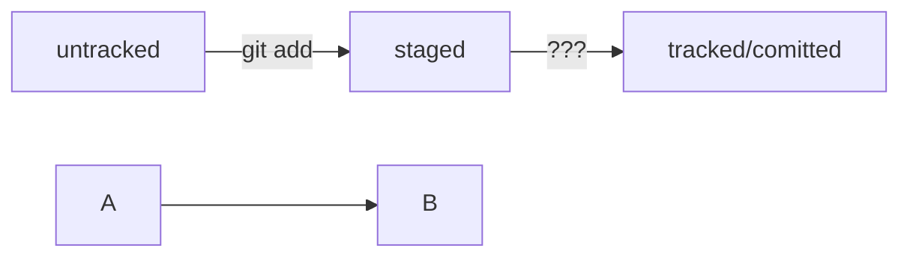

## __Выделение текста__

Вы можете выделять текст в markdown с помощью символов `_` или `*`. Например:

Пример _курсива_ и **жирного** текста.

## Заголовки

Заголовки можно создавать с помощью символа `#`. Чем больше `#`, тем меньше заголовок. Например:

# Заголовок первого уровня
## Заголовок второго уровня
### Заголовок третьего уровня

## Выделение кода


``` 
mkdir my_project
cd my_project
git init
```


## Hash
Уникальный идентификатор коммита (SHA-1, 40 символов).

Пример: a9c3e1f2b7a8d3e...

Нужен, чтобы ссылаться на конкретный коммит.

## Log (git log)

Показывает историю коммитов.

Команда: git log

Что показывает:

commit: хеш коммита

Author: автор коммита

Date: дата

Message: сообщение коммита

Кратко: git log --oneline (покажет короткие хеши и сообщения)

## HEAD
Указатель на текущий коммит/ветку.

Обычно указывает на последнюю версию текущей ветки.

## Статусы файлов в Git

Показывает состояние файлов в рабочем каталоге и индексе (staging area).
Возможные состояния:

Untracked	-  Новый файл, не под контролем Git

Modified - 	Файл изменён, но не добавлен в индекс

Staged (или Changes to be committed) -	Файл добавлен в индекс и готов к коммиту

Deleted	- Файл удалён

"Changes not staged for commit" — изменены, но не git add

"Changes to be committed" — уже git add, ждут git commit

"Untracked files" — Git их не отслеживает

